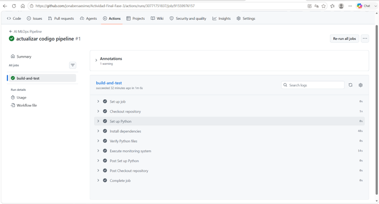

<div align="center">

# 🚀 Plataforma MLOps para el Monitoreo, Observabilidad y Operación Continua de Modelos de Machine Learning

### Integración Continua • GitHub Actions • MLflow • Streamlit • Data Drift • Alertas • Runbooks

</div>


---

### 🎓 Proyecto Académico

**FASE 3 - Actividad Final**

**Materia:** Gestión de Proyectos de Inteligencia Artificial

**Profesor:** Luis Vázquez

**Alumno:** Jonathan Daniel Bernal Sánchez

**Universidad Tecmilenio**

**Agosto 2026**

</div>

---

# 📌 Descripción

Este proyecto implementa una **plataforma MLOps para la observabilidad, monitoreo y detección de Data Drift en modelos de Machine Learning**, desarrollada como parte de la **Fase 3 – Actividad Final** de la materia **Gestión de Proyectos de Inteligencia Artificial**.

La solución tiene como objetivo supervisar el comportamiento de un modelo una vez entrenado, mediante el monitoreo de métricas de desempeño, el registro de experimentos con **MLflow**, la generación de alertas inteligentes, la detección de **Data Drift** y la ejecución de **Runbooks** para apoyar la respuesta ante incidentes.

Como complemento, se desarrolló un **Dashboard interactivo con Streamlit**, el cual permite simular cambios en la distribución de los datos y visualizar de manera práctica el funcionamiento del detector de Data Drift.

La solución también incorpora un **pipeline automatizado de Integración Continua (CI) con GitHub Actions**, encargado de configurar el entorno, instalar dependencias, validar el código y ejecutar automáticamente el sistema cada vez que se actualiza el repositorio. Además, el uso de **Git y GitHub** permite aplicar prácticas de **GitOps**, control de versiones, trazabilidad y validación continua.

Este proyecto integra conceptos fundamentales de **Machine Learning, MLOps, observabilidad, GitOps e Integración Continua**, demostrando la importancia de mantener un seguimiento permanente de los modelos de Inteligencia Artificial para garantizar su confiabilidad, reproducibilidad, estabilidad y mantenimiento durante todo su ciclo de vida.
---

# 🚀 Características

La plataforma integra diferentes componentes de **Machine Learning, MLOps, observabilidad y automatización**, permitiendo supervisar el comportamiento de un modelo durante todo su ciclo de vida y automatizar su validación mediante prácticas de Integración Continua.

| Funcionalidad | Estado |
|---------------|:------:|
| 🤖 Entrenamiento de un modelo Random Forest | ✅ |
| 📈 Registro de experimentos con MLflow | ✅ |
| 💾 Persistencia del modelo con Joblib | ✅ |
| 📊 Monitoreo de métricas del modelo | ✅ |
| 🚨 Sistema inteligente de alertas | ✅ |
| 📜 Registro automático de eventos (Logs) | ✅ |
| 🌊 Detección de Data Drift mediante KS Test | ✅ |
| 📋 Runbooks para respuesta a incidentes | ✅ |
| 🖥️ Dashboard interactivo desarrollado con Streamlit | ✅ |
| 🔄 Pipeline Automatizado con GitHub Actions (CI) | ✅ |
| 🌿 Control de versiones mediante Git y GitHub | ✅ |
| ⚙️ Validación automática del proyecto | ✅ |

## 🎯 Objetivos del proyecto

- Desarrollar una plataforma MLOps para la observabilidad y monitoreo de modelos de Machine Learning.
- Implementar un pipeline automatizado de Integración Continua (CI) utilizando GitHub Actions.
- Registrar automáticamente experimentos, métricas y artefactos mediante MLflow.
- Supervisar continuamente el desempeño del modelo mediante indicadores operativos.
- Detectar cambios en la distribución de los datos (Data Drift) utilizando la prueba Kolmogorov-Smirnov (KS Test).
- Generar alertas inteligentes para facilitar la identificación temprana de incidentes.
- Proporcionar recomendaciones de respuesta mediante Runbooks automatizados.
- Desarrollar un Dashboard interactivo con Streamlit para visualizar el comportamiento del sistema.
- Implementar prácticas de GitOps y control de versiones mediante Git y GitHub.
- Demostrar la aplicación de conceptos de MLOps, observabilidad e integración continua en una solución funcional de Inteligencia Artificial.
---

# 🏗 Arquitectura del Proyecto

La siguiente arquitectura representa el flujo general de operación de la plataforma MLOps desarrollada. Además del entrenamiento y monitoreo del modelo, se incorporó un pipeline automatizado de Integración Continua (CI) mediante GitHub Actions, responsable de validar automáticamente el proyecto cada vez que se realizan cambios en el repositorio.

```text                       ┌───────────────────────┐
                              │   GitHub Repository   │
                              └───────────┬───────────┘
                                          │
                                          ▼
                              ┌───────────────────────┐
                              │ GitHub Actions (CI)   │
                              └───────────┬───────────┘
                                          │
                                          ▼
                         ┌─────────────────────────────────┐
                         │ Breast Cancer Wisconsin Dataset │
                         └──────────────┬──────────────────┘
                                        │
                                        ▼
                           ┌─────────────────────────────┐
                           │ Entrenamiento Random Forest │
                           └──────────────┬──────────────┘
                                          │
                       ┌──────────────────┴──────────────────┐
                       ▼                                     ▼
             ┌──────────────────┐                ┌────────────────────┐
             │ Modelo (.pkl)    │                │ MLflow             │
             │ Joblib           │                │ Experimentos       │
             └─────────┬────────┘                └────────────────────┘
                       │
                       ▼
            ┌────────────────────────────────────┐
            │ Sistema de Monitoreo (main.py)     │
            └───────────────┬────────────────────┘
                            │
          ┌─────────────────┼─────────────────┐
          ▼                 ▼                 ▼
 ┌────────────────┐ ┌────────────────┐ ┌────────────────┐
 │ Alertas        │ │ Data Drift     │ │ Logs           │
 │ alerts.py      │ │ drift.py       │ │ logger.py      │
 └────────┬───────┘ └────────┬───────┘ └────────────────┘
          │                  │
          └──────────┬───────┘
                     ▼
          ┌────────────────────────┐
          │ Runbooks               │
          │ runbooks.py            │
          └────────────┬───────────┘
                       ▼
          ┌────────────────────────┐
          │ Dashboard Streamlit    │
          └────────────────────────┘
```

---


## 🧩 Componentes principales

| Componente | Función |
|------------|---------|
| **.github/workflows/ci.yml** | Define el Pipeline Automatizado de Integración Continua (CI) mediante GitHub Actions. |
| **train.py** | Entrena el modelo Random Forest y registra el experimento en MLflow. |
| **main.py** | Orquesta el flujo completo de monitoreo, alertas, detección de Data Drift y ejecución de Runbooks. |
| **monitor.py** | Evalúa las métricas de desempeño del modelo. |
| **alerts.py** | Genera alertas según el comportamiento observado del modelo. |
| **drift.py** | Detecta cambios en la distribución de los datos mediante la prueba estadística Kolmogorov-Smirnov (KS Test). |
| **logger.py** | Registra automáticamente los eventos del sistema en archivos de log para facilitar la trazabilidad. |
| **runbooks.py** | Proporciona recomendaciones de respuesta ante incidentes detectados durante el monitoreo. |
| **app.py** | Dashboard interactivo desarrollado con Streamlit para simular escenarios de Data Drift. |
| **requirements.txt** | Contiene las dependencias necesarias para instalar y ejecutar correctamente la plataforma. |
---

# 💻 Tecnologías Utilizadas

La plataforma fue desarrollada utilizando herramientas ampliamente empleadas en proyectos de Ciencia de Datos, Machine Learning, MLOps e Integración Continua.

| Tecnología | Versión | Propósito |
|------------|:-------:|-----------|
| 🐍 Python | 3.13 | Lenguaje principal del proyecto. |
| 🐼 Pandas | 2.x | Manipulación y análisis de datos. |
| 🔢 NumPy | 2.x | Operaciones numéricas y procesamiento de arreglos. |
| 🤖 Scikit-Learn | 1.x | Entrenamiento y evaluación del modelo Random Forest. |
| 📈 MLflow | 3.14 | Registro de experimentos, métricas y artefactos del modelo. |
| 🌊 SciPy | 1.x | Detección de Data Drift mediante la prueba Kolmogorov-Smirnov (KS Test). |
| 💾 Joblib | Última | Serialización y almacenamiento del modelo entrenado. |
| 🖥️ Streamlit | 1.60 | Dashboard interactivo para la simulación de Data Drift. |
| 🌿 Git | 2.x | Control de versiones del proyecto. |
| ☁️ GitHub | Plataforma | Administración del repositorio y colaboración. |
| ⚙️ GitHub Actions | Plataforma | Pipeline automatizado de Integración Continua (CI). |
| 📝 Logging | Python Standard Library | Registro automático de eventos del sistema. |

---

## 📂 Estructura del Proyecto

```text
Actividad-Final-Fase-3
│
├── .github/
│   └── workflows/
│       └── ci.yml
│
├── data/
│   └── breast_cancer.csv
│
├── images/
│
├── logs/
│   └── monitor.log
│
├── mlruns/
│
├── models/
│   └── random_forest_model.pkl
│
├── src/
│   ├── alerts.py
│   ├── drift.py
│   ├── logger.py
│   ├── monitor.py
│   ├── runbooks.py
│   ├── train.py
│   └── utils.py
│
├── app.py
├── main.py
├── requirements.txt
└── README.md
```

---

## 📁 Descripción de carpetas

| Carpeta | Descripción |
|----------|-------------|
| **.github/workflows/** | Contiene el Pipeline Automatizado de Integración Continua (CI) mediante GitHub Actions. |
| **data/** | Contiene el conjunto de datos utilizado para entrenar y evaluar el modelo. |
| **images/** | Almacena las capturas de pantalla utilizadas en este README. |
| **logs/** | Guarda el archivo `monitor.log` con el historial de eventos generados durante la operación del sistema. |
| **mlruns/** | Directorio generado automáticamente por MLflow para almacenar experimentos, métricas y artefactos. |
| **models/** | Contiene el modelo entrenado serializado mediante Joblib. |
| **src/** | Incluye todos los módulos del sistema de monitoreo, alertas, detección de Data Drift y Runbooks. |

---

# 🔄 Pipeline Automatizado (CI)

Como parte de la evolución de la plataforma se implementó un **Pipeline Automatizado de Integración Continua (CI)** utilizando **GitHub Actions**.

Cada vez que se realiza un **Push** sobre el repositorio, GitHub ejecuta automáticamente las siguientes actividades:

- 📥 Descarga del repositorio.
- 🐍 Configuración del entorno con Python 3.13.
- 📦 Instalación automática de dependencias.
- ✅ Validación de la sintaxis del proyecto.
- ▶️ Ejecución automática del sistema de monitoreo.
- ✔️ Confirmación de una ejecución exitosa.

Esta automatización fortalece la confiabilidad del proyecto, garantiza la reproducibilidad del entorno y facilita la validación continua del código mediante prácticas de **MLOps** y **GitOps**.

<p align="center">
    
</p>

---

# 📸 Evidencias del Proyecto

A continuación se presentan las principales evidencias del funcionamiento de la plataforma MLOps desarrollada. Las imágenes muestran la implementación de los diferentes componentes de observabilidad, monitoreo, automatización y validación continua incorporados durante el desarrollo del proyecto.

---

## ⚙️ Pipeline Automatizado (GitHub Actions)

Como parte de la evolución del proyecto se implementó un Pipeline Automatizado de Integración Continua (CI) utilizando GitHub Actions. Cada actualización del repositorio desencadena automáticamente un flujo de validación que instala las dependencias, verifica el código y ejecuta el sistema de monitoreo.

<p align="center">
    
</p>

---

## 🖥 Dashboard de Monitoreo (Streamlit)

El Dashboard desarrollado con Streamlit permite modificar la distribución de una variable del conjunto de datos y simular diferentes escenarios de Data Drift, facilitando la visualización del comportamiento del detector implementado.

<p align="center">
    
</p>

---

## 📈 Registro de Experimentos (MLflow)

MLflow registra automáticamente los parámetros, métricas, artefactos y ejecuciones del modelo, proporcionando trazabilidad completa durante el ciclo de vida del proyecto.

<p align="center">
    
</p>

---

## 💻 Ejecución del Sistema

Durante la ejecución del proyecto se entrenó el modelo Random Forest, se registraron automáticamente los experimentos en MLflow, se evaluaron las métricas de desempeño, se verificó la existencia de Data Drift y se generaron alertas, logs y Runbooks para apoyar la toma de decisiones.

<p align="center">
    
</p>

---

# ⚙️ Flujo de Funcionamiento del Sistema

La plataforma fue diseñada siguiendo principios de **MLOps**, incorporando un flujo de trabajo que integra entrenamiento, monitoreo, observabilidad y automatización mediante un Pipeline de Integración Continua (CI). De esta forma, cada actualización del código es validada automáticamente antes de ejecutar el sistema de monitoreo y supervisión del modelo.

El flujo general de operación es el siguiente:

```text
Repositorio GitHub
        │
        ▼
GitHub Actions (CI)
        │
        ▼
Instalación de dependencias
        │
        ▼
Validación del código
        │
        ▼
Carga del Dataset
        │
        ▼
Entrenamiento del modelo Random Forest
        │
        ▼
Registro del experimento en MLflow
        │
        ▼
Almacenamiento del modelo (.pkl)
        │
        ▼
Evaluación del desempeño
        │
        ▼
Generación de Alertas
        │
        ▼
Detección de Data Drift
        │
        ▼
Registro de eventos (Logs)
        │
        ▼
Generación de Runbooks
        │
        ▼
Dashboard Streamlit
```

Durante cada ejecución, el pipeline valida automáticamente la integridad del proyecto y posteriormente el sistema registra las métricas obtenidas, almacena los experimentos en MLflow, evalúa el estado del modelo, identifica posibles cambios en la distribución de los datos mediante la detección de **Data Drift**, genera alertas y proporciona recomendaciones a través de los **Runbooks**. Finalmente, toda la información puede visualizarse de forma interactiva mediante el Dashboard desarrollado con **Streamlit**, proporcionando una solución integral para el monitoreo y la operación continua del modelo.

---

# 📊 Métricas del Modelo

El modelo seleccionado para este proyecto fue un **Random Forest Classifier**, entrenado sobre el conjunto de datos **Breast Cancer Wisconsin Dataset**.

Las métricas obtenidas fueron las siguientes:

| Métrica | Resultado |
|---------|----------:|
| Accuracy | **97.37 %** |
| Precision | **100.00 %** |
| Recall | **92.86 %** |
| F1 Score | **96.30 %** |

Estos resultados muestran un excelente desempeño del modelo para la clasificación del conjunto de datos utilizado, siendo especialmente relevante la alta precisión obtenida.

---

# 📈 Seguimiento de Experimentos con MLflow

MLflow fue utilizado como plataforma para registrar automáticamente cada entrenamiento realizado.

En cada ejecución se almacenan:

- Parámetros utilizados durante el entrenamiento.
- Métricas de desempeño.
- Modelo entrenado.
- Artefactos generados.
- Historial de ejecuciones.

Gracias a ello es posible mantener la trazabilidad completa del ciclo de vida del modelo, facilitando futuras comparaciones y reproducciones del experimento.

---

# 🌊 Detección de Data Drift

Uno de los componentes más importantes del proyecto es la detección automática de **Data Drift**.

El sistema compara la distribución original de los datos con un nuevo conjunto de observaciones mediante la prueba estadística **Kolmogorov-Smirnov (KS Test)**.

Si la diferencia estadística supera el umbral definido, el sistema indica que existe evidencia de Data Drift.

### Estados posibles

| Estado | Significado |
|---------|-------------|
| ✅ INFO | No se detectó Drift. |
| ⚠️ WARNING | Existe evidencia de cambios en la distribución de los datos. |
| 🚨 CRITICAL | El comportamiento del modelo podría verse comprometido y requiere atención inmediata. |

Esta funcionalidad permite anticipar posibles degradaciones del modelo antes de que impacten significativamente su desempeño.

---

# 🚨 Sistema de Alertas

El módulo de alertas analiza continuamente el comportamiento del modelo y clasifica su estado operativo.

Dependiendo de las métricas obtenidas, el sistema genera alertas automáticas para facilitar la toma de decisiones.

| Nivel | Descripción |
|-------|-------------|
| 🟢 INFO | El modelo opera dentro de los parámetros esperados. |
| 🟡 WARNING | Se detectan desviaciones que deben monitorearse. |
| 🔴 CRITICAL | Se recomienda intervenir el modelo o realizar un nuevo entrenamiento. |

Este mecanismo representa una primera aproximación a un sistema de observabilidad utilizado en ambientes productivos.

---

# 📋 Runbooks

Cuando el sistema detecta una condición de alerta o evidencia de **Data Drift**, propone automáticamente un conjunto de recomendaciones conocidas como **Runbooks**, cuyo objetivo es estandarizar la respuesta ante incidentes y facilitar la toma de decisiones durante la operación del modelo.

Entre las principales acciones sugeridas se encuentran:

- Validar la calidad de los datos de entrada.
- Revisar las métricas de desempeño del modelo.
- Analizar la presencia de Data Drift mediante la prueba KS.
- Reentrenar el modelo utilizando datos recientes.
- Documentar el incidente para mantener la trazabilidad.
- Registrar las acciones correctivas implementadas.

Los Runbooks constituyen un componente fundamental dentro de la plataforma MLOps desarrollada, ya que permiten responder de manera estructurada ante posibles degradaciones del modelo y fortalecen las prácticas de observabilidad y operación continua.

---

# 🖥 Dashboard Interactivo

Como complemento al sistema de monitoreo se desarrolló una aplicación utilizando **Streamlit**, la cual permite visualizar de forma interactiva el comportamiento del modelo y simular diferentes escenarios de operación.

El Dashboard permite:

- Seleccionar cualquier variable del conjunto de datos.
- Modificar artificialmente su distribución.
- Simular distintos porcentajes de alteración.
- Ejecutar nuevamente el detector de Data Drift.
- Visualizar el estado generado por el sistema.
- Analizar el comportamiento del detector de forma dinámica.

Esta interfaz facilita la comprensión del funcionamiento interno del detector de **Data Drift** y complementa el proceso de observabilidad de la plataforma MLOps sin necesidad de modificar directamente el código fuente.

---

# 📂 Archivos Generados

Durante la ejecución del proyecto se generan automáticamente diversos archivos que permiten mantener la trazabilidad, reproducibilidad y monitoreo continuo de la plataforma.

| Archivo | Descripción |
|----------|-------------|
| **random_forest_model.pkl** | Modelo entrenado almacenado mediante Joblib. |
| **monitor.log** | Registro de eventos generados durante la ejecución del sistema. |
| **mlruns/** | Historial completo de experimentos, métricas y artefactos registrados por MLflow. |
| **.github/workflows/ci.yml** | Configuración del Pipeline Automatizado mediante GitHub Actions. |
| **README.md** | Documentación técnica y guía de instalación de la plataforma. |

---

# 🚀 Instalación

## 1. Clonar el repositorio

```bash
git clone https://github.com/jonabersaesime/Actividad-Final-Fase-3.git
```

## 2. Acceder al proyecto

```bash
cd Actividad-Final-Fase-3
```

## 3. Instalar las dependencias

```bash
pip install -r requirements.txt
```

---

# ▶️ Ejecución del Proyecto

## Validación automática mediante GitHub Actions

Cada vez que se realiza un **Push** al repositorio, GitHub ejecuta automáticamente el Pipeline de Integración Continua encargado de:

- Instalar las dependencias.
- Configurar el entorno de Python.
- Validar el código fuente.
- Ejecutar automáticamente el sistema de monitoreo.

---

## Ejecutar el sistema de monitoreo

```bash
python main.py
```

---

## Iniciar MLflow

```bash
mlflow ui
```

Posteriormente abrir:

```
http://localhost:5000
```

---

## Ejecutar el Dashboard

```bash
streamlit run app.py
```

El Dashboard estará disponible en:

```
http://localhost:8501
```

---

# ✅ Resultados Obtenidos

Durante el desarrollo del proyecto se implementaron satisfactoriamente los siguientes componentes:

- ✔ Entrenamiento del modelo Random Forest.
- ✔ Registro automático de experimentos mediante MLflow.
- ✔ Persistencia del modelo utilizando Joblib.
- ✔ Sistema de monitoreo de métricas.
- ✔ Detección automática de Data Drift.
- ✔ Sistema inteligente de alertas.
- ✔ Registro automático de eventos mediante archivos Log.
- ✔ Generación de Runbooks.
- ✔ Dashboard interactivo desarrollado con Streamlit.
- ✔ Pipeline Automatizado mediante GitHub Actions.
- ✔ Integración Continua (CI).
- ✔ Control de versiones mediante Git y GitHub.

El resultado final representa una **plataforma MLOps** para el monitoreo y observabilidad de modelos de Machine Learning, integrando conceptos de Integración Continua, GitOps, MLflow, Data Drift, Alertas, Runbooks y Dashboards interactivos para fortalecer la confiabilidad y el mantenimiento del sistema durante todo su ciclo de vida.

---

# 🎯 Conclusiones

El desarrollo de este proyecto permitió integrar los principales componentes necesarios para la operación y supervisión de un modelo de Machine Learning bajo un enfoque de **MLOps**, abordando aspectos que van más allá del entrenamiento del modelo y que resultan fundamentales para su funcionamiento en entornos reales.

A través de la implementación de indicadores de desempeño, alertas inteligentes, dashboards de monitoreo, detección de Data Drift y Runbooks de respuesta, fue posible construir un flujo de observabilidad capaz de identificar oportunamente posibles anomalías y proponer acciones para su atención.

Asimismo, la incorporación de herramientas como **MLflow** para el registro de experimentos, **Streamlit** para la visualización interactiva y **GitHub Actions** para la automatización del pipeline de Integración Continua fortaleció la trazabilidad, reproducibilidad y confiabilidad del sistema. La integración de estas tecnologías permitió automatizar procesos de validación, facilitar el control de versiones mediante Git y garantizar que cada actualización del proyecto sea verificada antes de formar parte de una versión estable.

Finalmente, este proyecto permitió aplicar de manera práctica los conocimientos adquiridos durante la materia **Gestión de Proyectos de Inteligencia Artificial**, integrando conceptos de Machine Learning, observabilidad, automatización, GitOps e Integración Continua en una solución funcional preparada para evolucionar hacia escenarios reales de operación.

---

# 🤖 Uso de Inteligencia Artificial

Durante el desarrollo de esta actividad se utilizó Inteligencia Artificial como herramienta de apoyo para fortalecer el aprendizaje y mejorar la calidad de los entregables.

La IA fue utilizada para:

- Apoyar la redacción técnica de la documentación.
- Generar propuestas de arquitectura y diagramas.
- Mejorar la estructura del README.
- Revisar la organización del código.
- Explicar conceptos relacionados con Machine Learning, MLOps, GitOps, MLflow y Data Drift.
- Apoyar la integración del Pipeline Automatizado mediante GitHub Actions.

Todas las decisiones relacionadas con el diseño, implementación, pruebas, validación y documentación del sistema fueron realizadas y verificadas por el alumno.

---

# 📚 Referencias

- Breiman, L. (2001). *Random Forests*. Machine Learning, 45(1), 5–32.
- Pedregosa, F., et al. (2011). *Scikit-learn: Machine Learning in Python*. Journal of Machine Learning Research.
- Zaharia, M., et al. (2018). *Accelerating the Machine Learning Lifecycle with MLflow*.
- Scikit-learn Developers. *Scikit-learn Documentation*. https://scikit-learn.org/
- MLflow Documentation. https://mlflow.org/docs/latest/
- Streamlit Documentation. https://docs.streamlit.io/
- SciPy Documentation. https://docs.scipy.org/
- GitHub. *GitHub Actions Documentation*. https://docs.github.com/actions
- IBM. (2024). *MLOps: What is Machine Learning Operations?*
- NIST. *Artificial Intelligence Risk Management Framework (AI RMF 1.0).*

---

<div align="center">

## ⭐ Proyecto desarrollado con fines académicos

### FASE 3 – Actividad Final

**Maestría en Inteligencia Artificial**

**Universidad Tecmilenio**

**Gestión de Proyectos de Inteligencia Artificial**

**Jonathan Daniel Bernal Sánchez**

**2026**

</div>