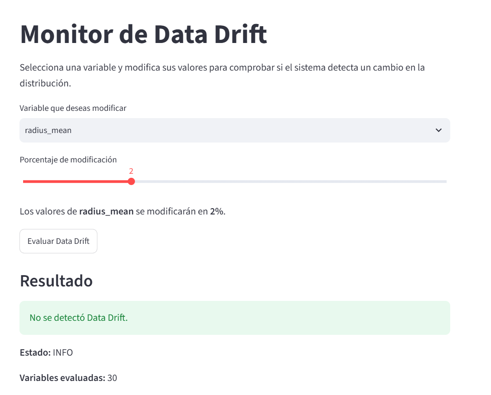
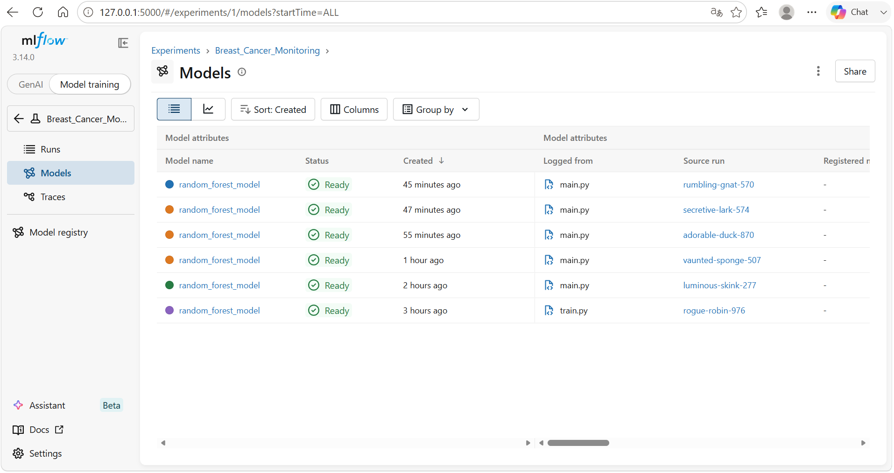
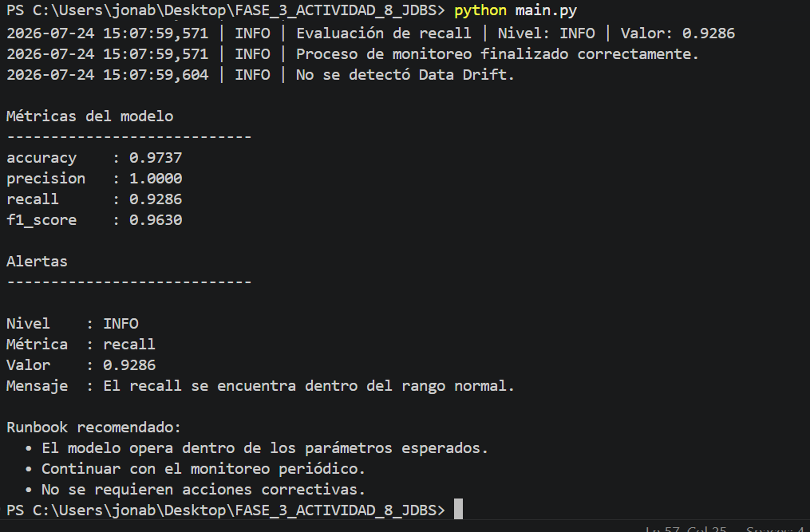

<div align="center">

# 📊 Monitor Inteligente para Modelos de Machine Learning

### Observabilidad, Monitoreo, Alertas y Detección de Data Drift


---

### 🎓 Proyecto Académico

**FASE 3 - Actividad 8**

**Materia:** Gestión de Proyectos de Inteligencia Artificial

**Profesor:** Luis Vázquez

**Alumno:** Jonathan Daniel Bernal Sánchez

**Universidad Tecmilenio**

**Julio 2026**

</div>

---

# 📌 Descripción

Este proyecto implementa un sistema de **observabilidad para modelos de Machine Learning**, desarrollado como parte de la **Fase 3** de la materia **Gestión de Proyectos de Inteligencia Artificial**.

La solución tiene como objetivo supervisar el comportamiento de un modelo una vez entrenado, mediante el monitoreo continuo de métricas de desempeño, el registro de experimentos con **MLflow**, la generación de alertas inteligentes, la detección de **Data Drift** y la ejecución de **Runbooks** para apoyar la respuesta ante incidentes.

Como complemento, se desarrolló un **Dashboard interactivo con Streamlit**, el cual permite simular cambios en la distribución de los datos para visualizar de manera práctica el funcionamiento del detector de Data Drift.

Este proyecto integra conceptos fundamentales de **MLOps** y observabilidad, demostrando la importancia de mantener un seguimiento continuo de los modelos de Inteligencia Artificial para garantizar su confiabilidad, estabilidad y desempeño en ambientes reales.

---

# 🚀 Características

Este proyecto integra diferentes componentes de observabilidad para supervisar el comportamiento de un modelo de Machine Learning en un entorno simulado de producción.

| Funcionalidad | Estado |
|---------------|:------:|
| 🤖 Entrenamiento de un modelo Random Forest | ✅ |
| 📈 Registro de experimentos con MLflow | ✅ |
| 💾 Persistencia del modelo con Joblib | ✅ |
| 📊 Monitoreo de métricas del modelo | ✅ |
| 🚨 Sistema inteligente de alertas | ✅ |
| 📜 Registro automático de eventos (Logs) | ✅ |
| 🌊 Detección de Data Drift mediante KS Test | ✅ |
| 📋 Runbooks para respuesta a incidentes | ✅ |
| 🖥️ Dashboard interactivo desarrollado con Streamlit | ✅ |

---

## 🎯 Objetivos del proyecto

- Implementar un flujo completo de observabilidad para modelos de Machine Learning.
- Registrar automáticamente experimentos y métricas mediante MLflow.
- Supervisar continuamente el desempeño del modelo.
- Detectar cambios en la distribución de los datos (Data Drift).
- Generar alertas inteligentes para facilitar la detección de incidentes.
- Proporcionar recomendaciones mediante Runbooks.
- Desarrollar una interfaz gráfica que permita simular escenarios de monitoreo.

---

# 🏗 Arquitectura del Proyecto

El siguiente diagrama muestra el flujo general de funcionamiento del sistema de observabilidad desarrollado para este proyecto.

```text
                         ┌────────────────────┐
                         │ Breast Cancer Data │
                         └──────────┬─────────┘
                                    │
                                    ▼
                        ┌────────────────────────┐
                        │ Entrenamiento del      │
                        │ Modelo Random Forest   │
                        └──────────┬─────────────┘
                                   │
                    ┌──────────────┴──────────────┐
                    │                             │
                    ▼                             ▼
          ┌──────────────────┐          ┌─────────────────┐
          │ Modelo (.pkl)    │          │ MLflow          │
          │ Joblib           │          │ Experimentos    │
          └─────────┬────────┘          └─────────────────┘
                    │
                    ▼
          ┌──────────────────────────┐
          │ Sistema de Monitoreo      │
          │ (main.py / monitor.py)    │
          └──────────┬────────────────┘
                     │
      ┌──────────────┼───────────────┐
      ▼              ▼               ▼
┌───────────┐  ┌─────────────┐  ┌─────────────┐
│ Alertas   │  │ Data Drift  │  │ Logs        │
│ alerts.py │  │ drift.py    │  │ logger.py   │
└─────┬─────┘  └──────┬──────┘  └─────────────┘
      │               │
      └───────┬───────┘
              ▼
      ┌──────────────────┐
      │ Runbooks          │
      │ runbooks.py       │
      └─────────┬─────────┘
                ▼
      ┌──────────────────┐
      │ Dashboard         │
      │ Streamlit         │
      └──────────────────┘
```

---

## 🧩 Componentes principales

| Componente | Función |
|------------|---------|
| **train.py** | Entrena el modelo Random Forest y registra el experimento en MLflow. |
| **main.py** | Orquesta el flujo completo de monitoreo. |
| **monitor.py** | Evalúa las métricas del modelo. |
| **alerts.py** | Genera alertas según el desempeño observado. |
| **drift.py** | Detecta cambios en la distribución de los datos mediante la prueba KS. |
| **logger.py** | Registra los eventos del sistema en archivos de log. |
| **runbooks.py** | Propone acciones recomendadas cuando se detectan incidentes. |
| **app.py** | Dashboard interactivo desarrollado con Streamlit para simular escenarios de Data Drift. |

---

# 💻 Tecnologías Utilizadas

El proyecto fue desarrollado utilizando herramientas ampliamente empleadas en proyectos de Ciencia de Datos y MLOps.

| Tecnología | Versión | Propósito |
|------------|:-------:|-----------|
| 🐍 Python | 3.13 | Lenguaje principal del proyecto |
| 🐼 Pandas | 2.x | Manipulación y análisis de datos |
| 🔢 NumPy | 2.x | Operaciones numéricas |
| 🤖 Scikit-Learn | 1.x | Entrenamiento del modelo Random Forest |
| 📈 MLflow | 3.14 | Registro de experimentos y métricas |
| 🌊 SciPy | 1.x | Detección de Data Drift mediante KS Test |
| 💾 Joblib | Última | Almacenamiento del modelo entrenado |
| 🖥 Streamlit | 1.60 | Dashboard interactivo para simulación |
| 📝 Logging | Python Standard Library | Registro automático de eventos |

---

## 📂 Estructura del Proyecto

```text
FASE_3_ACTIVIDAD_8_JDBS
│
├── data/
│   └── breast_cancer.csv
│
├── images/
│
├── logs/
│   └── monitor.log
│
├── mlruns/
│
├── models/
│   └── random_forest_model.pkl
│
├── src/
│   ├── alerts.py
│   ├── drift.py
│   ├── logger.py
│   ├── monitor.py
│   ├── runbooks.py
│   ├── train.py
│   └── utils.py
│
├── app.py
├── main.py
├── requirements.txt
└── README.md
```

---

## 📁 Descripción de carpetas

| Carpeta | Descripción |
|----------|-------------|
| **data/** | Contiene el conjunto de datos utilizado para entrenar y evaluar el modelo. |
| **images/** | Almacena las capturas de pantalla utilizadas en este README. |
| **logs/** | Guarda el archivo `monitor.log` con el historial de eventos. |
| **mlruns/** | Directorio generado automáticamente por MLflow para almacenar los experimentos. |
| **models/** | Contiene el modelo entrenado serializado con Joblib. |
| **src/** | Incluye todos los módulos del sistema de monitoreo y observabilidad. |

---

# 📸 Evidencias del Proyecto

A continuación se muestran algunas evidencias del funcionamiento del sistema desarrollado.

---

## 🖥 Dashboard de Monitoreo (Streamlit)

El dashboard permite modificar la distribución de una variable y ejecutar la detección de **Data Drift** de forma interactiva.

<p align="center">
    
</p>

---

## 📈 Registro de Experimentos (MLflow)

MLflow registra automáticamente los parámetros, métricas y ejecuciones del modelo, permitiendo mantener la trazabilidad de los experimentos realizados.

<p align="center">
    
</p>

---

## 💻 Ejecución del Sistema

Durante la ejecución del proyecto se entrenó el modelo, se registró el experimento en MLflow, se evaluaron las métricas, se verificó la existencia de Data Drift y se generaron las alertas y Runbooks correspondientes.

<p align="center">
    
</p>

---

# ⚙️ Flujo de Funcionamiento del Sistema

El sistema fue diseñado para simular un entorno básico de **observabilidad para modelos de Machine Learning**, donde es posible entrenar un modelo, registrar sus experimentos, monitorear su desempeño y detectar posibles anomalías en los datos.

El flujo general de ejecución es el siguiente:

```text
Inicio
   │
   ▼
Carga del Dataset
   │
   ▼
Entrenamiento del modelo Random Forest
   │
   ▼
Registro del experimento en MLflow
   │
   ▼
Almacenamiento del modelo (.pkl)
   │
   ▼
Evaluación del desempeño
   │
   ▼
Generación de Alertas
   │
   ▼
Detección de Data Drift
   │
   ▼
Registro de eventos (Logs)
   │
   ▼
Generación de Runbooks
   │
   ▼
Visualización mediante Streamlit
```

Durante cada ejecución, el sistema registra automáticamente las métricas obtenidas, evalúa el estado del modelo, identifica posibles desviaciones en la distribución de los datos y propone acciones de respuesta cuando se detectan anomalías.

---

# 📊 Métricas del Modelo

El modelo seleccionado para este proyecto fue un **Random Forest Classifier**, entrenado sobre el conjunto de datos **Breast Cancer Wisconsin Dataset**.

Las métricas obtenidas fueron las siguientes:

| Métrica | Resultado |
|---------|----------:|
| Accuracy | **97.37 %** |
| Precision | **100.00 %** |
| Recall | **92.86 %** |
| F1 Score | **96.30 %** |

Estos resultados muestran un excelente desempeño del modelo para la clasificación del conjunto de datos utilizado, siendo especialmente relevante la alta precisión obtenida.

---

# 📈 Seguimiento de Experimentos con MLflow

MLflow fue utilizado como plataforma para registrar automáticamente cada entrenamiento realizado.

En cada ejecución se almacenan:

- Parámetros utilizados durante el entrenamiento.
- Métricas de desempeño.
- Modelo entrenado.
- Artefactos generados.
- Historial de ejecuciones.

Gracias a ello es posible mantener la trazabilidad completa del ciclo de vida del modelo, facilitando futuras comparaciones y reproducciones del experimento.

---

# 🌊 Detección de Data Drift

Uno de los componentes más importantes del proyecto es la detección automática de **Data Drift**.

El sistema compara la distribución original de los datos con un nuevo conjunto de observaciones mediante la prueba estadística **Kolmogorov-Smirnov (KS Test)**.

Si la diferencia estadística supera el umbral definido, el sistema indica que existe evidencia de Data Drift.

### Estados posibles

| Estado | Significado |
|---------|-------------|
| ✅ INFO | No se detectó Drift. |
| ⚠️ WARNING | Existe evidencia de cambios en la distribución de los datos. |
| 🚨 CRITICAL | El comportamiento del modelo podría verse comprometido y requiere atención inmediata. |

Esta funcionalidad permite anticipar posibles degradaciones del modelo antes de que impacten significativamente su desempeño.

---

# 🚨 Sistema de Alertas

El módulo de alertas analiza continuamente el comportamiento del modelo y clasifica su estado operativo.

Dependiendo de las métricas obtenidas, el sistema genera alertas automáticas para facilitar la toma de decisiones.

| Nivel | Descripción |
|-------|-------------|
| 🟢 INFO | El modelo opera dentro de los parámetros esperados. |
| 🟡 WARNING | Se detectan desviaciones que deben monitorearse. |
| 🔴 CRITICAL | Se recomienda intervenir el modelo o realizar un nuevo entrenamiento. |

Este mecanismo representa una primera aproximación a un sistema de observabilidad utilizado en ambientes productivos.

---

# 📋 Runbooks

Cuando se detecta una condición de alerta, el sistema propone automáticamente un conjunto de recomendaciones conocidas como **Runbooks**.

Entre las acciones sugeridas se encuentran:

- Validar la calidad de los datos de entrada.
- Revisar las métricas del modelo.
- Analizar la presencia de Data Drift.
- Reentrenar el modelo utilizando datos recientes.
- Documentar el incidente para futuras auditorías.

Los Runbooks ayudan a estandarizar la respuesta ante incidentes y facilitan el mantenimiento de modelos de Inteligencia Artificial.

---

# 🖥 Dashboard Interactivo

Como complemento al sistema de monitoreo se desarrolló una aplicación utilizando **Streamlit**.

El dashboard permite:

- Seleccionar cualquier variable del conjunto de datos.
- Modificar artificialmente su distribución.
- Simular distintos porcentajes de alteración.
- Ejecutar nuevamente el detector de Data Drift.
- Visualizar el estado generado por el sistema.

Esta interfaz facilita la comprensión del funcionamiento interno del detector de Drift sin necesidad de modificar directamente el código fuente.

---

# 📂 Archivos Generados

Durante la ejecución del proyecto se generan automáticamente diversos archivos que permiten mantener la trazabilidad del sistema.

| Archivo | Descripción |
|----------|-------------|
| random_forest_model.pkl | Modelo entrenado almacenado con Joblib. |
| monitor.log | Registro de eventos del sistema. |
| mlruns/ | Historial completo de experimentos registrados por MLflow. |

---

# 🚀 Instalación

1. Clonar el repositorio

```bash
git clone https://github.com/USUARIO/FASE_3_ACTIVIDAD_8_JDBS.git
```

2. Acceder al proyecto

```bash
cd FASE_3_ACTIVIDAD_8_JDBS
```

3. Instalar las dependencias

```bash
pip install -r requirements.txt
```

---

# ▶️ Ejecución del Proyecto

### Entrenar el modelo y ejecutar el monitoreo

```bash
python main.py
```

### Iniciar la interfaz de MLflow

```bash
mlflow ui
```

Posteriormente abrir:

```
http://localhost:5000
```

### Ejecutar el Dashboard

```bash
streamlit run app.py
```

El dashboard estará disponible en:

```
http://localhost:8501
```

---

# ✅ Resultados Obtenidos

Durante el desarrollo del proyecto se lograron implementar satisfactoriamente los siguientes componentes:

- ✔ Entrenamiento del modelo Random Forest.
- ✔ Registro automático de experimentos mediante MLflow.
- ✔ Persistencia del modelo utilizando Joblib.
- ✔ Sistema de monitoreo de métricas.
- ✔ Detección automática de Data Drift.
- ✔ Sistema inteligente de alertas.
- ✔ Registro de eventos mediante archivos Log.
- ✔ Generación de Runbooks.
- ✔ Dashboard interactivo desarrollado con Streamlit.

El resultado final representa una solución integral de observabilidad para modelos de Machine Learning que integra conceptos fundamentales de MLOps.

---

# 🎯 Conclusiones

El desarrollo de este proyecto permitió comprender la importancia de la observabilidad dentro del ciclo de vida de los modelos de Machine Learning. No basta con entrenar un modelo con buenos resultados iniciales; también es indispensable supervisar continuamente su comportamiento, detectar cambios en los datos y contar con mecanismos que permitan responder oportunamente ante posibles degradaciones del desempeño.

La integración de herramientas como **MLflow**, **Streamlit**, el sistema de **alertas**, los **Runbooks** y la detección de **Data Drift** demuestra cómo es posible construir soluciones más robustas, trazables y preparadas para escenarios reales de operación.

Asimismo, este proyecto permitió aplicar conceptos de **MLOps**, monitoreo y gestión del ciclo de vida de modelos, fortaleciendo las competencias adquiridas durante la materia de Gestión de Proyectos de Inteligencia Artificial.

---

# 🤖 Uso de Inteligencia Artificial

Durante el desarrollo de esta actividad se utilizó Inteligencia Artificial como herramienta de apoyo para fortalecer el aprendizaje y mejorar la calidad de los entregables.

La IA fue utilizada para:

- Apoyar la redacción técnica del proyecto.
- Generar propuestas de documentación.
- Revisar la organización del código.
- Mejorar la estructura del README.
- Explicar conceptos relacionados con MLOps, MLflow y Data Drift.

Todas las decisiones relacionadas con el diseño, implementación, pruebas y validación del sistema fueron realizadas por el alumno, verificando cada uno de los resultados obtenidos.

---

# 📚 Referencias

- Breiman, L. (2001). *Random Forests*. Machine Learning, 45(1), 5–32.
- Pedregosa, F., et al. (2011). *Scikit-learn: Machine Learning in Python*. Journal of Machine Learning Research.
- Zaharia, M., et al. (2018). *Accelerating the Machine Learning Lifecycle with MLflow*.
- Scikit-learn Developers. *Scikit-learn Documentation*. https://scikit-learn.org/
- MLflow Documentation. https://mlflow.org/docs/latest/
- Streamlit Documentation. https://docs.streamlit.io/
- SciPy Documentation. https://docs.scipy.org/
- IBM. (2024). *MLOps: What is Machine Learning Operations?*
- NIST. *Artificial Intelligence Risk Management Framework (AI RMF 1.0).*

---

<div align="center">

## ⭐ Proyecto desarrollado con fines académicos

**Maestría en Inteligencia Artificial**

**Universidad Tecmilenio**

**Gestión de Proyectos de Inteligencia Artificial**

**Jonathan Daniel Bernal Sánchez**

**2026**

</div>


